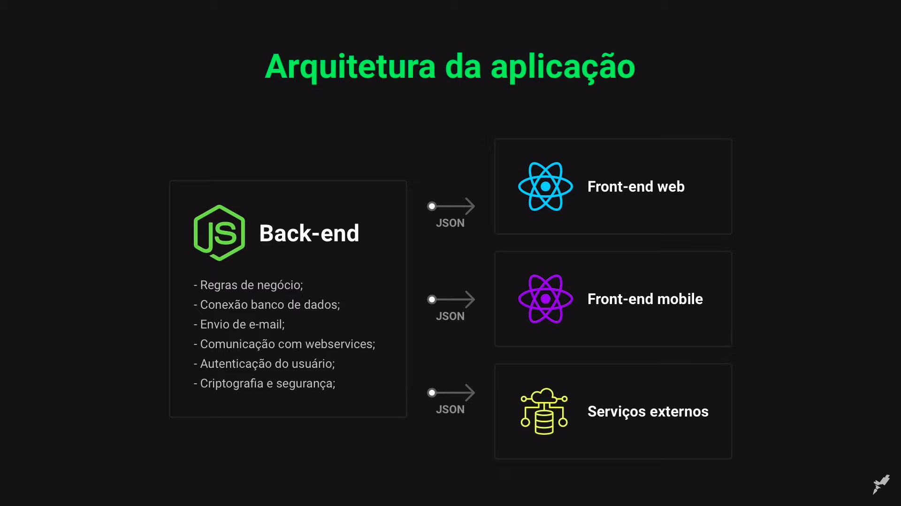

# SEMANA OMNISTACK 11.0

<p align="center">
  <a href="#rocket-tecnologias">Tecnologias</a>&nbsp;&nbsp;&nbsp;|&nbsp;&nbsp;&nbsp;
  <a href="#back-end">Back-end</a>&nbsp;&nbsp;&nbsp;|&nbsp;&nbsp;&nbsp;
  <a href="#front-end">Front-end</a>&nbsp;&nbsp;&nbsp;|&nbsp;&nbsp;&nbsp;
  <a href="#mobile">Mobile</a>&nbsp;&nbsp;&nbsp;|&nbsp;&nbsp;&nbsp;
  <a href="#dicionário">Dicionário</a>&nbsp;&nbsp;&nbsp;|&nbsp;&nbsp;&nbsp;
  <a href="#licença">Licença</a>
</p>

Abaixo segue a arquitetura utilizada nesta aplicação:



# Tecnologias

Esse projeto foi desenvolvido com as seguintes tecnologias:

- [Node.js](https://nodejs.org/en/)
- [React](https://reactjs.org)
- [React Native](https://facebook.github.io/react-native/)
- [Expo](https://expo.io/)

# **Back-End**
## **Criando o projeto de back-end com Node.JS**

1. Recomenda-se criar uma pasta chamada **`backend/`**.
2. Dentro desta, executa-se o comando a seguir:
```bash
npm init -y
```
Este comando criará o arquivo **`package.json`**, que contém as informações do projeto de back-end, como versão, nome, descrição e etc.

3. Em seguida deve-se instalar o express, que é um micro framework responsável por interpretar os parâmetros nas rotas da aplicação auxiliando assim o desenvolvimento do projeto, utilizando o comando abaixo para instalar:
```bash
npm install express
```
Dentro do arquivo **`package.json`** foi criado junto com o express a seguinte notação.
```JSON
 "dependencies": {
   "express": "^4.17.1"
 }
```

## **Iniciando o index.js**

O arquivo **index** será o arquivo principal da aplicação.

1. Criar o arquivo **`index.js`**;

2. Importar as funcionalidades do **express** dentro do arquivo **`index.js`**;
```javascript
const express = require('express');
```

3. Criar a variável para armazenar a aplicação;
```javascript
const app = express();
```

4. Configurar a aplicação para a porta `3333`. Assim o acesso será `localhost:3333`;
```javascript
app.listen(3333);
```

5. Logo o arquivo **`index.js`** ficará assim.
```javascript
const express = require('express');
const app = express();
app.listen(3333);
```
> Executando a aplicação e acessando o endereço `localhost:3333`, o erro `cannot GET /` é exibido porque nenhuma rota foi definida.

### Definindo rota raiz

Fazer o clássico `"Hello World!"`, é um bom jeito de validar se a aplicação está rodando como deveria, então o código abaixo é um bom exemplo para teste:

```javascript
const app = express();

app.get('/', (request, response) => {
    return response.send('Hello World!');
});
```

Como o **back-end** da aplicação será construído com o conceito **REST**, o objeto de retorno será um **JSON** ao invés de texto, portanto, seria:

```javascript
const app = express();

app.get('/', (request, response) => {
    return response.json({
        texto: "Hello World!",
        evento: "Semana Omnistack 11.0",
        aluno: "João Misutani"
    });
});
```

Logo o arquivo **`index.js`** ficará assim:

```javascript
const express = require('express');
const app = express();

//app.get('/', (request, response) => {
//    return response.send("Hello World!");
//});

app.get('/', (request, response) => {
    return response.json({
        texto: "Hello World!",
        evento: "Semana Omnistack 11.0",
        aluno: "João Misutani"
    });
});

app.listen(3333);
```

## **Instalando o Nodemon**

Este módulo é um utilitário que monitora todas as alterações nos arquivos da aplicação e reinicia automaticamente o servidor quando necessário.
```bash
npm install nodemon -D
```
> Para que o nodemon esteja disponível apenas no ambiente de desenvolvimento, utiliza-se a marcação "-D".

Para que o nodemon seja executado em automático, dentro do **`package.json`** na área de script, deve-se criar um script personalizado chamado start para executar o arquivo raiz com o nodemon:
```javascript
"start": "nodemon index.js"
```

## **Organizando arquivos**

Antes de começar o desenvolvimento do backend para ter uma melhor organização e padronização os arquivos e pastas criadas serão salvas dentro de **`src/`**, então recomenda-se os seguintes passos:

1. Criar a pasta `src/`;
2. Mover **`index.js`** para `src/`;
3. Modificar o arquivo **`packages.json`** com o novo correto de **`index.js`**:
```JSON
"start": "nodemon src/index.js"
```
4. Criar um novo arquivo **`routes.js`** dentro de `src/` para armazenar as rotas da aplicação.
```javascript
const express = require('express');

const routes = express.Router;
```
> A variável `routes` serve para *desacoplar* as rotas da aplicação.

Para que as rotas fiquem disponíveis para a aplicação, deve-se exportá-las:
```javascript
modules.export = routes;
```

Então **`routes.js`** ficará assim:

```javascript
const express = require('express');
const routes = express.Router();

module.exports = routes;
```

Agora com o arquivo pronto para receber as rotas da aplicação, é possível juntar o que foi visto previamente a respeito da **`rota raiz`**:

```javascript
const express = require('express');
const routes = express.Router();

routes.get('/', (request, response) => {
    return response.json({
        texto: "Hello World!",
        evento: "Semana Omnistack 11.0",
        aluno: "João Misutani"
    });
});

module.exports = routes;
```

5. O arquivo **`index.js`** deverá saber que as rotas que estão no arquivo **`routes.js`**. Para isso modifique o **`index.js`**:

```javascript
const express = require('express');
const routes = require('./routes');

const app = express();

app.use(express.json());
app.use(routes);
app.listen(3333);
```

## **Banco de dados**

Há diversos tipos de banco de dados,os principais estão citados abaixo:

### **Tipos de banco de dados:**

 * **SQL**: MySQL, SQLite, PostgreSQL, Oracle, Microsoft, SQL server.
 * **NoSQL**: mongoDB, CouchDB, etc.

O projeto utilizará a estrutura **SQL** e o banco **SQLite** para facilitar o desenvolvimento.

### **Manipulando dados no banco:**

**Pode-se usar duas abordagens:**

 * **Driver do banco**: onde o código é escrito em **SQL**
```SQL
SELECT * FROM users
```
 * **Query Builder**: onde o código é escrito em **JS**
```javascript
table('users').select('*').where();
```

A abordagem escolhida para o projeto foi **Query Builder** pois facilitará o desenvolvimento dentro do projeto, será utilizado [Knex.js](http://knexjs.org/) para a conexão com o banco e a interpretação do **Query Builder**.

## **Instalando o Knex.js**

1. Para instalar o **Knex.js** execute o comando:
```bash
npm install knex
```
2. Em seguida deve-se instalar o drive de conexão com o banco de dados (lembrando que este drive é utilizado somente para o banco escolhido neste projeto), com o comando:
```bash
npm install sqlite3
```
3. Para iniciar a conexão com banco de dados inicia-se o knex com o comando, que cria o arquivo de configuração do banco de dados **`knexfile.js`**, execute:
```
npx knex init
```

4. Criar um diretório `database/` dentro de `src/` e modificar o arquivo **`knexfile.js`** com esse mapeamento:
```javascript
development: {
    client: 'sqlite3',
    connection: {
      filename: './src/database/db.sqlite'
    }
  },
```

### **Criando funcionalidade para criação das tabelas**

As tabelas serão criadas utilizando **`migrations`** do **Knex.js**.

1. Criar uma pasta `migrations/` dentro de `src/database/`.

2. Modificar o `knexfile.js`, para adicionar a nova configuração de **`migrations`**
```javascript
development: {
    client: 'sqlite3',
    connection: {
      filename: './src/database/db.sqlite'
    },
    migrations: {
      directory: './src/database/migrations'
    }
  },
```

## **Entidades**

Agora com o **Knex.js** já configurado é hora de pensar nas entidades e seus atributos, que serão as tabelas no banco de dados, e com as entidades pode-se pensar nas regras de negócio e suas funcionalidades.

Com o layout do projeto proposto durante esse desafio será mais fácil de identificar as entidades, as regras de negócio e suas funcionalidades, segue link do [layout do projeto](https://www.figma.com/file/2C2yvw7jsCOGmaNUDftX9n/Be-The-Hero---OmniStack-11?node-id=37%3A394). Lembrando que é necessário ter conta no [Figma](http://figma.com/).

1. entidade é a **ONG**.
  - id;
  - name;
  - email;
  - whatsapp;
  - city;
  - uf.
2. entidade é o **CASO**.
  - id;
  - title;
  - description;
  - value;
  - ong_id;

### **Regras de negócio**

Com as entidades definidas é possível então estabelecer as regras de negócio:

1. **ONG**:
  - Precisam armazenar **CASO**;
  - Pode ter vários **CASO**'s.

2. **CASO**:
  - Pertence somente a uma **ONG**.

### **Funcionalidades**

Cada Entidade pode ter várias ações. As ações de todas as entidades serão as funcionalidades da aplicação.

1. A **ONG** pode fazer:

- login
- logout
- cadastro da ONG
- cadastro de caso
- deletar caso
- listar casos específicos de uma ONG

2. Na aplicação mobile, temos as seguintes funcionalidades:

- Listar todos os casos das ONGs
- Entrar em contato com uma ONG

### Criando a tabela de ONGS

1. Para criar a tabela **`ongs`**, executar o comando:
```bash
npx knex migrate:make create_ongs
```
> Um novo arquivo com final **`create_ongs.js`** será criado. Nesse arquivo ficará o código de criação da tabela **`ongs`**.

2. Modificar o método `up`, que será responsável pela criação da tabela:
```javascript
exports.up = function(knex) {
    return knex.schema.createTable('ongs', function(table) {
        table.string('id').primary();
        table.string('name').notNullable();
        table.string('email').notNullable();
        table.string('whatsapp').notNullable();
        table.string('city').notNullable();
        table.string('uf', 2).notNullable();
    });
};
```
> Aqui será inserido todos os campos necessários para a entidade **`ONG`**, com seus respectivos tipos.

3. O método `down`, será o comando responsável por deletar a tabela **`ongs`**.
```javascript
exports.down = function(knex) {
    return knex.schema.dropTable('ongs');
};
```
> O método `down` diz ao `knex`o que será necessário fazer caso algo dê errado e seja voltar atrás.

4. E para executar esse código e efetivamente criar a tabela **`ongs`** no banco de dados:
```bash
npx knex migrate:latest
```
> Após executar esse comando o banco de dados **`db.sqlite`** será criado em `src/database/`.

5. É comum que ao executar o comando o alerta seja exibido:
```
sqlite does not support inserting default values. Set the `useNullAsDefault` flag to hide this warning. (see docs http://knexjs.org/#Builder-insert).
```
 Para que nas próximas migrações o alerta não seja exibido, o recomendado é colocar uma flag no arquivo **`knexfile.js`**:
```
useNullAsDefault: true
```

### Criando a tabela de incidents

O mesmo será feito para a tabela `incidents` *(`casos` em inglês)*.

1. Para criar a tabela:
```bash
npx knex migrate:make create_incidents
```

2. Editar o arquivo criado **`create_incidents.js`**:
```javascript
exports.up = function(knex) {
    return knex.schema.createTable('incidents', function(table) {
        table.increments();
        table.string('title').notNullable();
        table.string('description').notNullable();
        table.decimal('value').notNullable();
        table.string('ong_id').notNullable();
        table.foreign('ong_id').references('id').inTable('ongs');
    });  
};

exports.down = function(knex) {
    return knex.schema.dropTable('incidents');
};
```

3. Executar o comando:
```bash
npx knex migrate:latest
```
> Aqui é importante entender que a tabela **`incidents`** possui um campo de identificação que é **auto incrementável** e que está relacionada com a tabela `ongs` através da **chave estrangeira** **`ongs_is`**.

## **Criando a base da aplicação**

### **Conceitos básicos**

métodologia **REST** trata-se de uma abstração da arquitetura da **WWW**, mais precisamente, é um estilo arquitetural. Resumidamente, o REST consiste em princípios/regras/constraints que, quando seguidas são denominados Web services RESTful.

Em um Web service REST, as solicitações são feitas ao **URI**, que terá uma resposta formatada em HTML, XML, JSON ou algum outro formato, neste projeto será utilizado o formato **JSON**.

O Protocolo **HTTP** é o mais comum para a realização das chamadas **API** e as operações (métodos HTTP) usadas são:

**Protocolos HTTP:**

- **GET**: Consultar uma informação no back-end
- **POST**: Criar uma informação no back-end
- **PUT**: Alterar uma informação no back-end
- **DELETE**: Remover uma informação no back-end

Nas chamadas a **API** são utilizados alguns tipos de parâmetros, que podem ser mandados no **URI** ou no corpo da requisição.

**Tipos de parâmetros:**

 - **Query Params**: Parâmetros nomeados na rota enviados na rota após o símbolo de "?"(filtros, paginação).
 - **Route Params / Path Params**: Parâmetros utilizados para identificar recursos.
 - **Request Body**: Corpo da requisição, utilizado para criar ou alterar recursos.

### **CRUD ONG's**

Para tornar a aplicação mais escalável é hora de reorganizar a estrutura dos arquivos:

  1. Criar uma pasta `/controllers` dentro de `/src`:
  >As lógicas das entidades serão colocadas aqui.

  2. Criar um novo arquivo **`ongs_controller.js`** dentro de `/src/controllers` onde ficará as lógicas para as **ONG's**:
```javascript
const express = require('express');

module.exports = {};
```

  3. Será necessário fazer alguns preparativos dentro **`routes.js`** para adicionar as rotas das entidades começando pela **ONG**:
```javascript
const express = require('express');
const ongs_controller = require('./controllers/ongs_controller');

const routes = express.Router();

module.exports = routes;
```

  4. Criar um novo arquivo **`connection.js`** dentro de `src/database/` para gerenciar as conexões ao banco de dados:
```javascript
const knex = require('knex');
const config = require('../../knexfile');

const connection = knex(config.development);

module.exports = connection;
```
Esse arquivo exportará a variável `connection` que contém as configurações necessárias para a conexão com o **DB**. Portanto, sempre que necessário comunicar com o BD, será necessário importar esse arquivo **`connection.js`**.

  - Para adicionar a variável `connection` use:
```javascript
const connection = require('./database/connection');
```

  5. Agora com essa estrutura pronta é hora de construir o **CRUD** da **Entidade ONG**
___
  -  **C** *RUD* / **C** *riate* (Criação):
  > Será a rota responsável pela criação de uma nova **ONG** no **DB**.

  1. Dentro do arquivo **`ongs_controller.js`** será escrito o método de criação:
```javascript
async create(request, response) {

    return response.json();
};
```

  2. Agora com a estrutura pronta é hora de implementar o método para adicionar uma **ONG**:
```javascript
const connection = require('../database/connection');
const crypto = require('crypto');

  const {name, email, whatsapp, city, uf} = request.body;

  const id = crypto.randomBytes(4).toString('HEX');

  await connection('ongs').insert({
      id,
      name,
      email,
      whatsapp,
      city,
      uf
  });

  return response.json({id});
```
    - As variáveis passadas na requisição serão capturadas uma a uma para serem armazenadas na entidade/tabela `ongs`.
    - O campo `id` desta tabela não será gerado automaticamente pelo banco de dados, será gerado através da biblioteca `crypto`. Onde uma string aleatória formada por 4 bytes hexadecimais será gerada pelo `crypto`.
    - Para inserir os dados na tabela será utilizado o `connection.insert` que é um método do `knex` passando como argumento (nesse caso `ongs`) a tabela onde os dados serão armazenados. Os dados devem ser inseridos na ordem em que foram criados.
    - Com o comando `return response.json({id})` será retornado ao usuário o `id` gerado para a ONG. Esse `id` vai servir de identificação da ONG para o login.
    - Utilizar `async` ou `await` garante que o `id` só será retornado após a inserção dos dados na tabela `ongs`.

  3. Finalizando então o método de criação temos:
```javascript
const connection = require('../database/connection');
const crypto = require('crypto');

  async create(request, response) {

    const {name, email, whatsapp, city, uf} = request.body;

    const id = crypto.randomBytes(4).toString('HEX');

    await connection('ongs').insert({
        id,
        name,
        email,
        whatsapp,
        city,
        uf
    });

    return response.json({id});
  }
```
  4. Agora com o método finalizado, basta chama-lo em **`routes.js`**:
```javascript
const express = require('express');
const ongs_controller = require('./controllers/ongs_controller');

const routes = express.Router();

routes.post('/ongs', ongs_controller.create);

module.exports = routes;
```
> Seguindo as regras do **REST** todo método de criação deve ser **POST**.
___
  -  *C* **R** *UD* / **R** *ead* (Consulta):
  > Será a rota responsável por consultar e mostar os dados de uma **ONG**.

  1. Dentro do arquivo **`ongs_controller.js`** será escrito o método de consulta:
```javascript
async read(request, response) {

  return response.json();
};
```

  2. Agora com a estrutura pronta é hora de implementar o método para consultar uma **ONG**:
```javascript
  const {id} = request.body;

  const ong = await connection('ongs').where('id',id);

  return response.json(ong);
```
    - A variável passada na requisição será capturada para ser consultado tabela `ongs`.
    - Para consultar os dados será utilizado o `connection.where` que é um método do `knex` passando como argumento (nesse caso `ongs`) a tabela onde os dados serão consultados.
    - Com o comando `return response.json(ong)` retornará ao usuário uma entidade ONG.
    - Utilizar `async` ou `await` garante que a ONG só retornará após a consulta dos dados na tabela `ongs`.

  3. Finalizando então o método de consulta temos:
```javascript
async read(request, response) {

  const {id} = request.body;

  const ong = await connection('ongs').where('id',id);

  return response.json(ong);
}
```

  4. Agora com o método finalizado, basta chama-lo em **`routes.js`**:
```javascript
const express = require('express');
const ongs_controller = require('./controllers/ongs_controller');

const routes = express.Router();

routes.post('/ongs', ongs_controller.create);
routes.get('/ongs', ongs_controller.read);

module.exports = routes;
```
> Seguindo as regras do **REST** todo método de consulta deve ser **GET**.
___
  -  *CR* **U** *D* / **U** *pdate* (Atualização):
  > Será a rota responsável por atualizar dados de uma **ONG**.

  1. Dentro do arquivo **`ongs_controller.js`** será escrito o método de consulta:
```javascript
async update(request, response) {

  return response.json();
};
```

  2. Agora com a estrutura pronta é hora de implementar o método para atualizar uma **ONG**:
```javascript
  const {id, name, email, whatsapp, city, uf} = request.body;

  const ong = await connection('ongs')
    .where('id',id).update({
        name: name,
        email: email,
        whatsapp: whatsapp,
        city: city,
        uf: uf
    });

  return response.json(ong);
```
    - As variáveis passadas na requisição serão capturadas uma a uma e caso estejam presentes serem alteradas na tabela `ongs`.
    - Para alterar os dados será utilizado o `connection.where.update` que é um método do `knex` passando como argumento (nesse caso `ongs`) a tabela onde os dados serão alterados.
    - Com o comando `return response.json(ong)` retornará ao usuário uma entidade ONG.
    - Utilizar `async` ou `await` garante que a ONG só retornará após a atualização dos dados na tabela `ongs`.

  3. Finalizando então o método de atualização temos:
```javascript
async update(request, response) {

  const {id, name, email, whatsapp, city, uf} = request.body;

  const ong = await connection('ongs')
    .where('id',id).update({
        name: name,
        email: email,
        whatsapp: whatsapp,
        city: city,
        uf: uf
    });

  return response.json(ong);
}
```

  4. Agora com o método finalizado, basta chama-lo em **`routes.js`**:
```javascript
const express = require('express');
const ongs_controller = require('./controllers/ongs_controller');

const routes = express.Router();

routes.post('/ongs', ongs_controller.create);
routes.get('/ongs', ongs_controller.read);
routes.put('/ongs', ongs_controller.update);

module.exports = routes;
```
> Seguindo as regras do **REST** todo método de atualização deve ser **PUT**.
___
  -  *CRU* **D** / **D** *elete* (Remover):
  > Será a rota responsável por remover uma **ONG**.

  1. Dentro do arquivo **`ongs_controller.js`** será escrito o método de remoção:
```javascript
async delete(request, response) {

  return response.json();
};
```

  2. Agora com a estrutura pronta é hora de implementar o método para remover uma **ONG**:
```javascript
  const {id} = request.body;

  const ong = await connection('ongs')
    .where('id',id).del();

  return response.json(ong);
```
    - As variáveis passadas na requisição serão capturadas uma a uma e caso estejam presentes serem alteradas na tabela `ongs`.
    - Para alterar os dados será utilizado o `connection.where.update` que é um método do `knex` passando como argumento (nesse caso `ongs`) a tabela onde os dados serão alterados.
    - Com o comando `return response.json(ong)` retornará ao usuário uma entidade ONG.
    - Utilizar `async` ou `await` garante que a ONG só retornará após a remoção dos dados na tabela `ongs`.

  3. Finalizando então o método de remoção temos:
```javascript
async delete(request, response) {

  const {id} = request.body;

  const ong = await connection('ongs')
    .where('id',id).del();

  return response.json(ong);
}
```

  4. Agora com o método finalizado, basta chama-lo em **`routes.js`**:
```javascript
const express = require('express');
const ongs_controller = require('./controllers/ongs_controller');

const routes = express.Router();

routes.post('/ongs', ongs_controller.create);
routes.get('/ongs', ongs_controller.read);
routes.put('/ongs', ongs_controller.update);
routes.delete('/ongs', ongs_controller.delete);

module.exports = routes;
```
> Seguindo as regras do **REST** todo método de remoção deve ser **DELETE**.
___

### **CRUD incidentes**

  1. Com a nova estrutura pronta é hora de criar um controller para os **CASOS** (*incidents*) chamado **`incidents_controller.js`** em `/src/controllers`.
```javascript
const express = require('express');

module.exports = {};
```

  2. Será necessário adicionar esta nova controller dentro **`routes.js`**, para adicionar as rotas da entidade **Incident**:
```javascript
const express = require('express');
const ongs_controller = require('./controllers/ongs_controller');
const incidents_controller = require('./controllers/incidents_controller');

const routes = express.Router();

//Rotas para ONGs
routes.post('/ongs', ongs_controller.create);
routes.get('/ongs', ongs_controller.read);
routes.put('/ongs', ongs_controller.update);
routes.delete('/ongs', ongs_controller.delete);

module.exports = routes;
```

  3. Agora é hora de construir o **CRUD** da **Entidade Incident**
___
  -  **C** *RUD* / **C** *riate* (Criação):
  > Será a rota responsável pela criação de um novo **Incident**.

  1. Dentro do arquivo **`incidents_controller.js`** adicionar o método:
```javascript
async create(request, response) {

    return response.json();
};
```

  2. Agora essa estrutura é hora de implementar a lógica:
```javascript
const connection = require('../database/connection');

  const {title, description, value} = request.body;

  const ong_id = request.headers.authorization;

  const [id] = await connection('incidents').insert({
      title,
      description,
      value,
      ong_id
  });

  return response.json({id});
```
    - A novidade aqui é a utilização de headers (cabeçalho da requisição) para pegar o valor `ong_id` o ID da ONG responsável pelo caso/incident da requisição. É possível simular o header da requisição com o Insomnia.
    - Como o metodo pode retornar um arry/lista de resposta e o resultado esperado é apenas o id, a variável fica entra cochetes para pegar somente este resultado.
    - Após da inserção do caso/incident a resposta retorna o `id` recém criado.

  3. Finalizando então:
```javascript
const connection = require('../database/connection');

  async create(request, response) {

    const {title, description, value} = request.body;

    const ong_id = request.headers.authorization;

    const id = await connection('incidents').insert({
        title,
        description,
        value,
        ong_id
    });

    return response.json({id});
  }
```

  4. Com o método finalizado, basta chama-lo em **`routes.js`**:
```javascript
const express = require('express');
const ongs_controller = require('./controllers/ongs_controller');
const incidents_controller = require('./controllers/incidents_controller');

const routes = express.Router();

//Rotas para ONGs
routes.post('/ongs', ongs_controller.create);
routes.get('/ongs', ongs_controller.read);
routes.put('/ongs', ongs_controller.update);
routes.delete('/ongs', ongs_controller.delete);

//Rotas para Incidents
routes.post('/incidents', incidents_controller.create);

module.exports = routes;
```
> Seguindo as regras do **REST** todo método de criação deve ser **POST**.
___
  -  *C* **R** *UD* / **R** *ead* (Consulta):
  > Será a rota responsável por consultar e mostar os dados de um **Incident**.

  1. Dentro de **`incidents_controller.js`** criar o método de consulta:
```javascript
async read(request, response) {

  return response.json();
};
```

  2. Com essa estrutura é hora de implementar o método de consulta:
```javascript
  const {id} = request.body;

  const incident = await connection('incidents').where('id',id);

  return response.json(incident);
```

  3. Finalizando então:
```javascript
async read(request, response) {

  const {id} = request.body;

  const incident = await connection('incidents').where('id',id);

  return response.json(incident);
}
```

  4. Com o método finalizado, basta chama-lo em **`routes.js`**:
```javascript
const express = require('express');
const ongs_controller = require('./controllers/ongs_controller');
const incidents_controller = require('./controllers/incidents_controller');

const routes = express.Router();

//Rotas para ONGs
routes.post('/ongs', ongs_controller.create);
routes.get('/ongs', ongs_controller.read);
routes.put('/ongs', ongs_controller.update);
routes.delete('/ongs', ongs_controller.delete);

//Rotas para Incidents
routes.post('/incidents', incidents_controller.create);
routes.get('/incidents', incidents_controller.read);

module.exports = routes;
```
> Seguindo as regras do **REST** todo método de consulta deve ser **GET**.
___
  -  *CR* **U** *D* / **U** *pdate* (Atualização):
  > Será a rota responsável por atualizar dados de um **Incidents**.

  1. Dentro de **`incidents_controller.js`** escreva o método de consulta:
```javascript
async update(request, response) {

  return response.json();
};
```

  2. Com essa estrutura é hora de implementar o método para atualizar:
```javascript
  const {title, description, value} = request.body;

  const incident = await connection('incidents')
    .where('id',id).update({
        title: title,
        description: description,
        value: value
    });

  return response.json(incident);
```

  3. Finalizando então o método de atualização temos:
```javascript
async update(request, response) {

  const {title, description, value} = request.body;

  const incident = await connection('incidents')
    .where('id',id).update({
        title: title,
        description: description,
        value: value
    });

  return response.json(incident);
}
```

  4. Agora com o método finalizado, basta chama-lo em **`routes.js`**:
```javascript
const express = require('express');
const ongs_controller = require('./controllers/ongs_controller');

const routes = express.Router();

//Rotas para ONGs
routes.post('/ongs', ongs_controller.create);
routes.get('/ongs', ongs_controller.read);
routes.put('/ongs', ongs_controller.update);
routes.delete('/ongs', ongs_controller.delete);

//Rotas para Incidents
routes.post('/incidents', incidents_controller.create);
routes.get('/incidents', incidents_controller.read);
routes.put('/incidents', incidents_controller.update);

module.exports = routes;
```
> Seguindo as regras do **REST** todo método de atualização deve ser **PUT**.
___
  -  *CRU* **D** / **D** *elete* (Remover):
  > Será a rota responsável por remover um **Incidents**.

  1. Dentro do arquivo **`incidents_controller.js`** escreva o método de remoção:
```javascript
async delete(request, response) {

  return response.json();
};
```

  2. Com essa estrutura é hora de implementar o método para remover:
```javascript
  const {id} = request.body;

  const incident = await connection('incidents')
    .where('id',id).del();

  return response.json(incident);
```

  3. Finalizando então o método de remoção:
```javascript
async delete(request, response) {

  const {id} = request.body;

  const incident = await connection('incidents')
    .where('id',id).del();

  return response.json(incident);
}
```

  4. Agora com o método finalizado, basta chama-lo em **`routes.js`**:
```javascript
const express = require('express');
const ongs_controller = require('./controllers/ongs_controller');

const routes = express.Router();

//Rotas para ONGs
routes.post('/ongs', ongs_controller.create);
routes.get('/ongs', ongs_controller.read);
routes.put('/ongs', ongs_controller.update);
routes.delete('/ongs', ongs_controller.delete);

//Rotas para Incidents
routes.post('/incidents', incidents_controller.create);
routes.get('/incidents', incidents_controller.read);
routes.put('/incidents', incidents_controller.update);
routes.delete('/incidents', incidents_controller.delete);

module.exports = routes;
```
> Seguindo as regras do **REST** todo método de remoção deve ser **DELETE**.
___

### Melhorias CRUD.

Pensar em problemas que possam ocorrer durante a aplicação ou até mesmo em melhorias é um processo normal, para evitar que um possivel erro cause alguma falha na aplicação. Então tendo isso em mente é hora de pensar em erros que podem ocorrer com os métodos já criados.

  1. Ao consultar uma entidade tem-se acesso a penas a uma entidade, e uma das funcionalidades presentes no layout é a listagem de *incidents* que cada **ONG** possue:

  - Primeiro ponto é escrever o código dentro de **`incidents_controller.js`**:
```javascript
 async index(request, response) {
        const { page = 1} = request.query;

        const [count] = await connection('incidents').count();

        const incidents = await connection('incidents')
            .join('ongs', 'ongs.id', '=', 'incidents.ong_id')
            .limit(5)
            .offset((page - 1) * 5)
            .select([
                'incidents.*',
                'ongs.name',
                'ongs.email',
                'ongs.whatsapp',
                'ongs.city',
                'ongs.uf'
            ]);

        response.header('X-Total-Count', count['count(*)']);
        return response.json(incidents);
    },
```
    - A variável de paginação ('page') passada como rota de consulta(query path) será capturada para realizar a busca e evitar que o retorno seja muito grande e ocorra problemas com limit de memória ou tempo de resposta;
    - Para saber o número total de incidents cadastrados o método utilixado é o `.count`, como o metodo pode retornar um arry/lista de resposta e o resultado esperado é apenas o count, a variável fica entra cochetes para pegar somente este resultado;
    - Como um incidents está diretamente relacionado a uma ong para trazer os dados junto com os dados do incident o método utilizado é o `.join`;
    - O metodo `.limit` é utilizado para limitar o número de incidents por página;
    - O metodo `.offset` é utilizado para indicar o primeiro incident no intervalo definido de limite de acordo com a página;
    - O metodo `.select` como visto anteriormente serve para trazer os resultados do DB, mas como incidents e ond possuem um atributo com o mesmo nome, neste caso 'id', a tratativa adotada será trazer os dados relacionados a ONG um a um já que o incident possuem o id de sua respectiva ONG, então não será necessário trazer este dado;
    - Para indicar ao front que ainda existem dados depois do intervado enviado será adicionado ao cabeçalho da resposta a chave `X-Total-Count` com o valor `cont` que é contem o valor total de incidents.

  - Com o método pronto só falta adicionalo em **`routes.js`** 
  ```javascript
  routes.get('/incidents', incidents_controller.index);
  ```

  2. As rotas que tem interações individuais é mais comum que id da entidade seja enviado na rota como **Route/Path Params**, agora que temos essa nova rota que lista os *incidents* tem um conflito de rotas pois já existia um método **GET** para a rota `/incidents`, então é hora de implementar essas alterações:

  - Dentro de **`incidents_controller.js`**, será necessário alterar esses métodos:
```javascript
  async read(request, response) {

    const {id} = request.params;
  
    const incident = await connection('incidents').where('id',id);
  
    return response.json(incident);
  },

  async update(request, response) {

    const {id} = request.params;

    const {title, description, value} = request.body;
  
    const incident = await connection('incidents')
      .where('id',id).update({
          title: title,
          description: description,
          value: value
      });
  
    return response.json(incident);
  },

  async delete(request, response) {

    const {id} = request.params;
  
    const incident = await connection('incidents')
      .where('id',id).del();
  
    return response.json(incident);
  }
```

  - Dentro de **`ongs_controller.js`**, será necessário alterar esses métodos:
```javascript
  async read(request, response) {

    const {id} = request.params;

    const ong = await connection('ongs').where('id',id);

    return response.json(ong);
  },

  async update(request, response) {

    const {id} = request.params;

    const {name, email, whatsapp, city, uf} = request.body;

    const ong = await connection('ongs')
      .where('id',id).update({
          name: name,
          email: email,
          whatsapp: whatsapp,
          city: city,
          uf: uf
      });

    return response.json(ong);
  },

  async delete(request, response) {

    const {id} = request.params;

    const ong = await connection('ongs')
      .where('id',id).del();

    return response.json(ong);
  }
```


# **Front-End**

## **Entendendo React**

Em poucas palavras, é uma biblioteca JavaScript para criação de interfaces para o usuário, desenvolvida e mantida pelo Facebook, sua primeira release saiu em 2013. É uma lib open-source com mais de 1k de colaboradores ativos no GitHub.

Sem sombras de dúvida uma das características que esta fazendo a comunidade adotar o React para o desenvolvimento de suas aplicações é a facilidade de aprendizagem, a forma como seus códigos são declarativos, facilitando na visualização e a manutenção do código.

Abaixo está a diferença entre a abordagem tradicional e a abordagem **SPA** usada pelo **REACT**


## **Criando o projeto de front-end com REACT.JS**

1. Para criar o projeto front-end deve-se estar na pasta raiz onde encontra-se a pasta back-end e executar o comando:
```bash
npx create-react-app frontend
```
Este comando criará a pasta **`frontend/`** e em seu interior uma estrutura de pastas do projeto, com esta estrutura o projeto estará pronto para ser executado.

2. Para validar se o projeto está funcionando normalmente basta executar o comando a seguir dentro da pasta **`frontend/`**.
```bash
npm start
```

# **Móbile**

## **Criando o projeto móbile com React Native**

## **Entendendo React Native**


# **Dicionário**

|Sigla|Nomenclatura|Tradução|
|-----|------------|--------|
|**REST**|*Representational State Transfer*|Transferência de Estado Representacional|
|**URI**|*Uniform Resource Identifier*|Identificador de Recursos Universal|
|**API**|*Application Programming Interface*|Interface de Programação de Aplicações|
|**JSON**|*JavaScript Object Notation*|Notação de Objetos JavaScript|
|**SQL**|*Structured Query Language*|Linguagem de Consulta Estruturada|
|**WWW**|*World Wide Web*|Rede mundial de computadores|
|**SPA**|*Single-page application*|Aplicativo de página única|
|**CRUD**|*Create, Read, Update and Delete*|Criar, Consultar, Atualizar e Remover|
|**DB**|*Data base*|Banco de dados|


# **Licença**

Esse projeto está sob a licença MIT. Veja o arquivo [LICENSE](../LICENSE.md) para mais detalhes.
