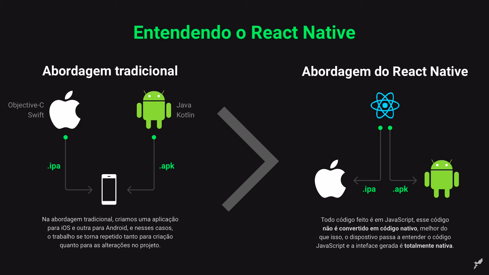
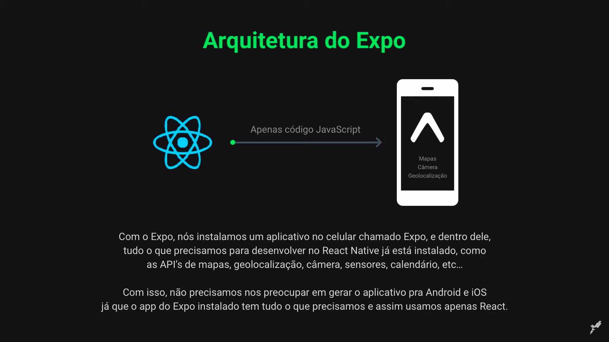

# SEMANA OMNISTACK 11.0

<p align="center">
  <a href="#rocket-tecnologias">Tecnologias</a>&nbsp;&nbsp;&nbsp;|&nbsp;&nbsp;&nbsp;
  <a href="#back-end">Back-end</a>&nbsp;&nbsp;&nbsp;|&nbsp;&nbsp;&nbsp;
  <a href="#front-end">Front-end</a>&nbsp;&nbsp;&nbsp;|&nbsp;&nbsp;&nbsp;
  <a href="#mobile">Mobile</a>&nbsp;&nbsp;&nbsp;|&nbsp;&nbsp;&nbsp;
  <a href="#dicionário">Dicionário</a>&nbsp;&nbsp;&nbsp;|&nbsp;&nbsp;&nbsp;
  <a href="#licença">Licença</a>
</p>

Abaixo segue a arquitetura utilizada nesta aplicação:


# Tecnologias

Esse projeto foi desenvolvido com as seguintes tecnologias:

- [Node.js](https://nodejs.org/en/)
- [React](https://reactjs.org)
- [React Native](https://facebook.github.io/react-native/)
- [Expo](https://expo.io/)

# **Back-End**
## **Criando o projeto de back-end com Node.JS**

1. Recomenda-se criar uma pasta chamada **`backend/`**.
2. Dentro desta, executa-se o comando a seguir:
```bash
npm init -y
```
Este comando criará o arquivo **`package.json`**, que contém as informações do projeto de back-end, como versão, nome, descrição e etc.

3. Em seguida deve-se instalar o express, que é um micro framework responsável por interpretar os parâmetros nas rotas da aplicação auxiliando assim o desenvolvimento do projeto, utilizando o comando abaixo para instalar:
```bash
npm install express
```
Dentro do arquivo **`package.json`** foi criado junto com o express a seguinte notação.
```JSON
 "dependencies": {
   "express": "^4.17.1"
 }
```

## **Iniciando o index.js**

O arquivo **index** será o arquivo principal da aplicação.

1. Criar o arquivo **`index.js`**;

2. Importar as funcionalidades do **express** dentro do arquivo **`index.js`**;
```javascript
const express = require('express');
```

3. Criar a variável para armazenar a aplicação;
```javascript
const app = express();
```

4. Configurar a aplicação para a porta `3333`. Assim o acesso será `localhost:3333`;
```javascript
app.listen(3333);
```

5. Logo o arquivo **`index.js`** ficará assim.
```javascript
const express = require('express');
const app = express();
app.listen(3333);
```
> Executando a aplicação e acessando o endereço `localhost:3333`, o erro `cannot GET /` é exibido porque nenhuma rota foi definida.

### Definindo rota raiz

Fazer o clássico `"Hello World!"`, é um bom jeito de validar se a aplicação está rodando como deveria, então o código abaixo é um bom exemplo para teste:

```javascript
const app = express();

app.get('/', (request, response) => {
    return response.send('Hello World!');
});
```

Como o **back-end** da aplicação será construído com o conceito **REST**, o objeto de retorno será um **JSON** ao invés de texto, portanto, seria:

```javascript
const app = express();

app.get('/', (request, response) => {
    return response.json({
        texto: "Hello World!",
        evento: "Semana Omnistack 11.0",
        aluno: "João Misutani"
    });
});
```

Logo o arquivo **`index.js`** ficará assim:

```javascript
const express = require('express');
const app = express();

//app.get('/', (request, response) => {
//    return response.send("Hello World!");
//});

app.get('/', (request, response) => {
    return response.json({
        texto: "Hello World!",
        evento: "Semana Omnistack 11.0",
        aluno: "João Misutani"
    });
});

app.listen(3333);
```

## **Instalando o Nodemon**

Este módulo é um utilitário que monitora todas as alterações nos arquivos da aplicação e reinicia automaticamente o servidor quando necessário.
```bash
npm install nodemon -D
```
> Para que o nodemon esteja disponível apenas no ambiente de desenvolvimento, utiliza-se a marcação "-D".

Para que o nodemon seja executado em automático, dentro do **`package.json`** na área de script, deve-se criar um script personalizado chamado start para executar o arquivo raiz com o nodemon:
```javascript
"start": "nodemon index.js"
```

## **Organizando arquivos**

Antes de começar o desenvolvimento do backend para ter uma melhor organização e padronização os arquivos e pastas criadas serão salvas dentro de **`src/`**, então recomenda-se os seguintes passos:

1. Criar a pasta `src/`;
2. Mover **`index.js`** para `src/`;
3. Modificar o arquivo **`packages.json`** com o novo correto de **`index.js`**:
```JSON
"start": "nodemon src/index.js"
```
4. Criar um novo arquivo **`routes.js`** dentro de `src/` para armazenar as rotas da aplicação.
```javascript
const express = require('express');

const routes = express.Router;
```
> A variável `routes` serve para *desacoplar* as rotas da aplicação.

Para que as rotas fiquem disponíveis para a aplicação, deve-se exportá-las:
```javascript
modules.export = routes;
```

Então **`routes.js`** ficará assim:

```javascript
const express = require('express');
const routes = express.Router();

module.exports = routes;
```

Agora com o arquivo pronto para receber as rotas da aplicação, é possível juntar o que foi visto previamente a respeito da **`rota raiz`**:

```javascript
const express = require('express');
const routes = express.Router();

routes.get('/', (request, response) => {
    return response.json({
        texto: "Hello World!",
        evento: "Semana Omnistack 11.0",
        aluno: "João Misutani"
    });
});

module.exports = routes;
```

5. O arquivo **`index.js`** deverá saber que as rotas que estão no arquivo **`routes.js`**. Para isso modifique o **`index.js`**:

```javascript
const express = require('express');
const routes = require('./routes');

const app = express();

app.use(express.json());
app.use(routes);
app.listen(3333);
```

6. Criar um diretório `database/` dentro de `src/` e modificar o arquivo **`knexfile.js`** com esse mapeamento:
```javascript
development: {
    client: 'sqlite3',
    connection: {
      filename: './src/database/db.sqlite'
    }
  },
```

## **Banco de dados**

Há diversos tipos de banco de dados,os principais estão citados abaixo:

### **Tipos de banco de dados:**

 * **SQL**: MySQL, SQLite, PostgreSQL, Oracle, Microsoft, SQL server.
 * **NoSQL**: mongoDB, CouchDB, etc.

O projeto utilizará a estrutura **SQL** e o banco **SQLite** para facilitar o desenvolvimento.

### **Manipulando dados no banco:**

**Pode-se usar duas abordagens:**

 * **Driver do banco**: onde o código é escrito em **SQL**
```SQL
SELECT * FROM users
```
 * **Query Builder**: onde o código é escrito em **JS**
```javascript
table('users').select('*').where();
```

A abordagem escolhida para o projeto foi **Query Builder** pois facilitará o desenvolvimento dentro do projeto, será utilizado [Knex.js](http://knexjs.org/) para a conexão com o banco e a interpretação do **Query Builder**.

## **Instalando o Knex.js**

1. Para instalar o **Knex.js** execute o comando:
```bash
npm install knex
```
2. Em seguida deve-se instalar o drive de conexão com o banco de dados (lembrando que este drive é utilizado somente para o banco escolhido neste projeto), com o comando:
```bash
npm install sqlite3
```
3. Para iniciar a conexão com banco de dados inicia-se o knex com o comando, que cria o arquivo de configuração do banco de dados **`knexfile.js`**, execute:
```
npx knex init
```

### **Criando funcionalidade para criação das tabelas**

As tabelas serão criadas utilizando **`migrations`** do **Knex.js**.

1. Criar uma pasta `migrations/` dentro de `src/database/`.

2. Modificar o `knexfile.js`, para adicionar a nova configuração de **`migrations`**
```javascript
development: {
    client: 'sqlite3',
    connection: {
      filename: './src/database/db.sqlite'
    },
    migrations: {
      directory: '/src/database/migrations'
    }
  },
```

## **Entidades**

Agora com o **Knex.js** já configurado é hora de pensar nas entidades e seus atributos, que serão as tabelas no banco de dados, e com as entidades pode-se pensar nas regras de negócio e suas funcionalidades.

Com o layout do projeto proposto durante esse desafio será mais fácil de identificar as entidades, as regras de negócio e suas funcionalidades, segue link do [layout do projeto](https://www.figma.com/file/2C2yvw7jsCOGmaNUDftX9n/Be-The-Hero---OmniStack-11?node-id=37%3A394). Lembrando que é necessário ter conta no [Figma](http://figma.com/).

1. entidade é a **ONG**.
  - id;
  - name;
  - email;
  - whatsapp;
  - city;
  - uf.
2. entidade é o **CASO**.
  - id;
  - title;
  - description;
  - value;
  - ong_id;

### **Regras de negócio**

Com as entidades definidas é possível então estabelecer as regras de negócio:

1. **ONG**:
  - Precisam armazenar **CASO**;
  - Pode ter vários **CASO**'s.

2. **CASO**:
  - Pertence somente a uma **ONG**.

### **Funcionalidades**

Cada Entidade pode ter várias ações. As ações de todas as entidades serão as funcionalidades da aplicação.

1. A **ONG** pode fazer:

- login
- logout
- cadastro da ONG
- cadastro de caso
- deletar caso
- listar casos específicos de uma ONG

2. Na aplicação mobile, temos as seguintes funcionalidades:

- Listar todos os casos das ONGs
- Entrar em contato com uma ONG

### Criando a tabela de ONGS

1. Para criar a tabela **`ongs`**, executar o comando:
```bash
npx knex migrate:make create_ongs
```
> Um novo arquivo com final **`create_ongs.js`** será criado. Nesse arquivo ficará o código de criação da tabela **`ongs`**.

2. Modificar o método `up`, que será responsável pela criação da tabela:
```javascript
exports.up = function(knex) {
    return knex.schema.createTable('ongs', function(table) {
        table.string('id').primary();
        table.string('name').notNullable();
        table.string('email').notNullable();
        table.string('whatsapp').notNullable();
        table.string('city').notNullable();
        table.string('uf', 2).notNullable();
    });
};
```
> Aqui será inserido todos os campos necessários para a entidade **`ONG`**, com seus respectivos tipos.

3. O método `down`, será o comando responsável por deletar a tabela **`ongs`**.
```javascript
exports.down = function(knex) {
    return knex.schema.dropTable('ongs');
};
```
> O método `down` diz ao `knex`o que será necessário fazer caso algo dê errado e seja voltar atrás.

4. E para executar esse código e efetivamente criar a tabela **`ongs`** no banco de dados:
```bash
npx knex migrate:latest
```
> Após executar esse comando o banco de dados `db.sqlite` será criado em `database`.

### Criando a tabela de incidents

O mesmo será feito para a tabela `incidents` *(`casos` em inglês)*.

1. Para criar a tabela:
```bash
npx knex migrate:make create_incidents
```

2. Editar o arquivo criado `create_incidents.js`:
```javascript
exports.up = function(knex) {
    return knex.schema.createTable('incidents', function(table) {
        table.increments();
        table.string('title').notNullable();
        table.string('description').notNullable();
        table.decimal('value').notNullable();
        table.string('ong_id').notNullable();
        table.foreign('ong_id').references('id').inTable('ongs');
    });  
};

exports.down = function(knex) {
    return knex.schema.dropTable('incidents');
};
```

3. Executar o comando:
```bash
npx knex migrate:latest
```
> Aqui é importante entender que a tabela **`incidents`** possui um campo de identificação que é **auto incrementável** e que está relacionada com a tabela `ongs` através da **chave estrangeira** **`ongs_is`**.

## **Criando a base da aplicação**

### **Conceitos básicos**

Metodologia **REST** trata-se de uma abstração da arquitetura da **WWW**, mais precisamente, é um estilo arquitetural. Resumidamente, o REST consiste em princípios/regras/constraints que, quando seguidas são denominados Web services RESTful.

Em um Web service REST, as solicitações são feitas ao **URI**, que terá uma resposta formatada em HTML, XML, JSON ou algum outro formato, neste projeto será utilizado o formato **JSON**.

O Protocolo **HTTP** é o mais comum para a realização das chamadas **API** e as operações (métodos HTTP) usadas são:

**Protocolos HTTP:**

- **GET**: Consultar uma informação no back-end
- **POST**: Criar uma informação no back-end
- **PUT**: Alterar uma informação no back-end
- **DELETE**: Remover uma informação no back-end

Nas chamadas a **API** são utilizados alguns tipos de parâmetros, que podem ser mandados no **URI** ou no corpo da requisição.

**Tipos de parâmetros:**

 - **Query Params**: Parâmetros nomeados na rota enviados na rota após o símbolo de "?"(filtros, paginação).
 - **Route Params / Path Params**: Parâmetros utilizados para identificar recursos.
 - **Request Body**: Corpo da requisição, utilizado para criar ou alterar recursos.


# **Front-End**

## **Entendendo React**

Em poucas palavras, é uma biblioteca JavaScript para criação de interfaces para o usuário, desenvolvida e mantida pelo Facebook, sua primeira release saiu em 2013. É uma lib open-source com mais de 1k de colaboradores ativos no GitHub.

Sem sombras de dúvida uma das características que esta fazendo a comunidade adotar o React para o desenvolvimento de suas aplicações é a facilidade de aprendizagem, a forma como seus códigos são declarativos, facilitando na visualização e a manutenção do código.

Abaixo está a diferença entre a abordagem tradicional e a abordagem **SPA** usada pelo **REACT**


## **Criando o projeto de front-end com REACT.JS**

1. Para criar o projeto front-end deve-se estar na pasta raiz onde encontra-se a pasta back-end e executar o comando:
```bash
npx create-react-app frontend
```
Este comando criará a pasta **`frontend/`** e em seu interior uma estrutura de pastas do projeto, com esta estrutura o projeto estará pronto para ser executado.

2. Para validar se o projeto está funcionando normalmente basta executar o comando a seguir dentro da pasta **`frontend/`**.
```bash
npm start
```

# **Móbile**

## **Criando o projeto móbile com React Native**

## **Entendendo React Native**







# **Dicionário**

|Sigla|Nomenclatura|Tradução|
|-----|------------|--------|
|**REST**|*Representational State Transfer*|Transferência de Estado Representacional|
|**URI**|*Uniform Resource Identifier*|Identificador de Recursos Universal|
|**API**|*Application Programming Interface*|Interface de Programação de Aplicações|
|**JSON**|*JavaScript Object Notation*|Notação de Objetos JavaScript|
|**SQL**|*Structured Query Language*|Linguagem de Consulta Estruturada|
|**WWW**|*World Wide Web*|Rede mundial de computadores|
|**SPA**|*Single-page application*|Aplicativo de página única|
|**CRUD**|*Create, Read, Update and Delete*|Criar, Consultar, Atualizar e Remover|
|**DB**|*Data base*|Banco de dados|


# **Licença**

Esse projeto está sob a licença MIT. Veja o arquivo [LICENSE](../LICENSE.md) para mais detalhes.
